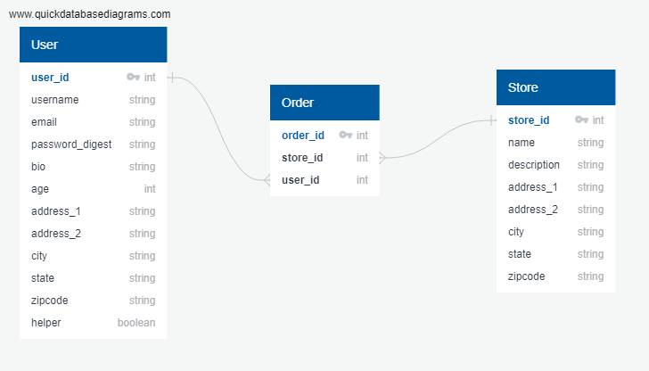

# HELP US DELIVER

Entity-relationship model:

## User Stories:
1. A user can login and select a store and place an order.

2. A helper can login and select an order and have it assigned to them.

3. A store can login and mark an order as ready for pickup.

4. A store can login and mark an order as picked up by a helper.

5. A helper can mark a delivery as complete, which will update the store's records and the users records. 

6. A user can mark the delivery as satisfactory, unsatisfactory or missing.
 
